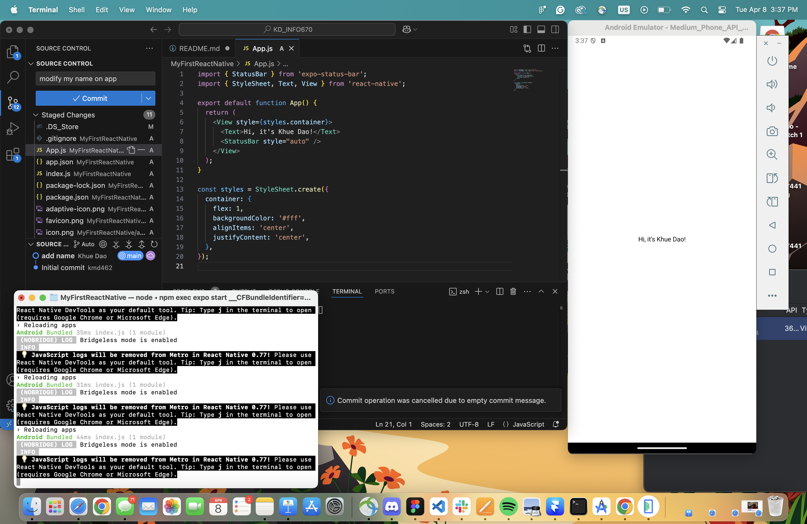
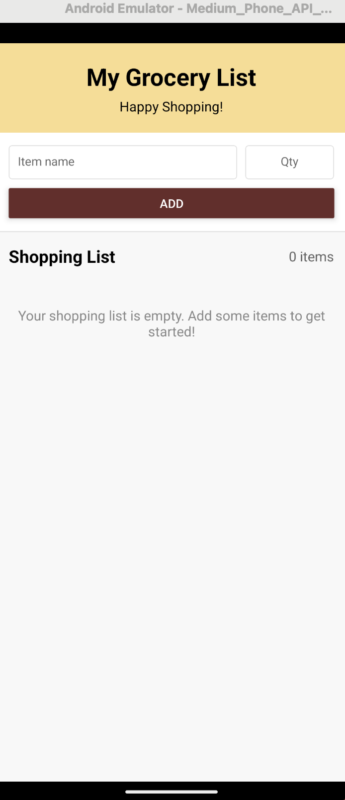
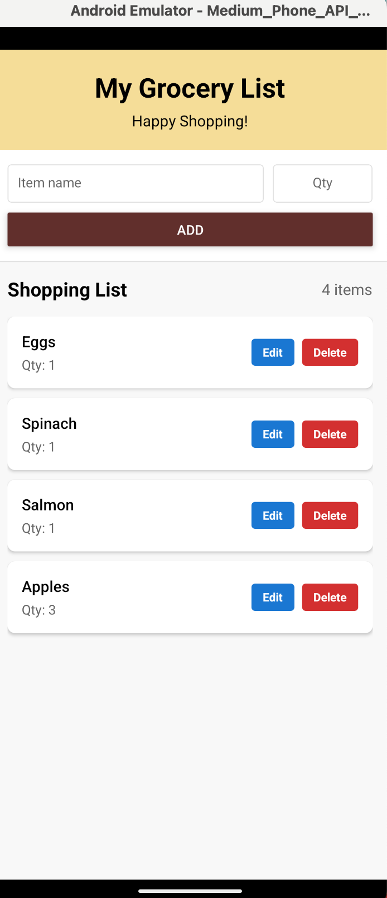
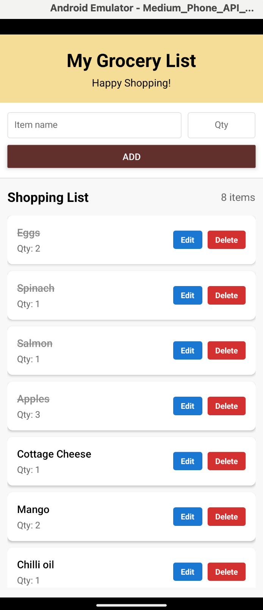
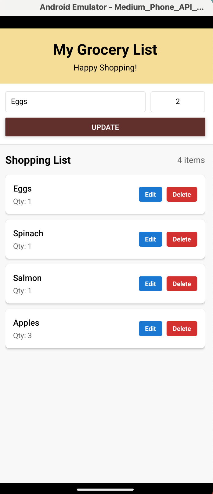
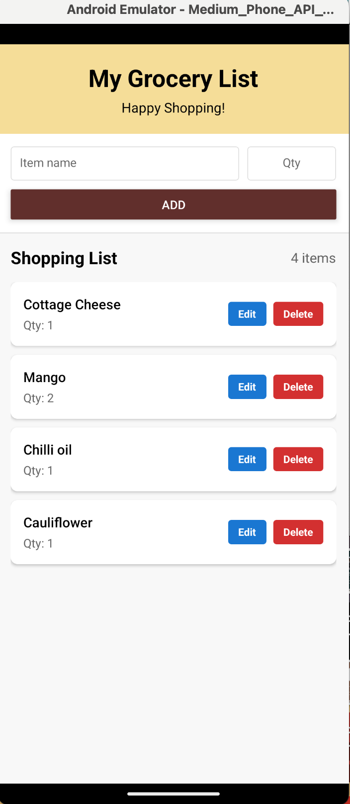
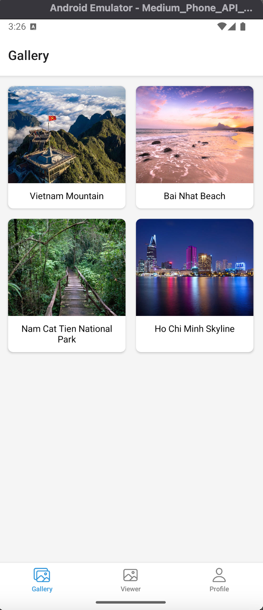
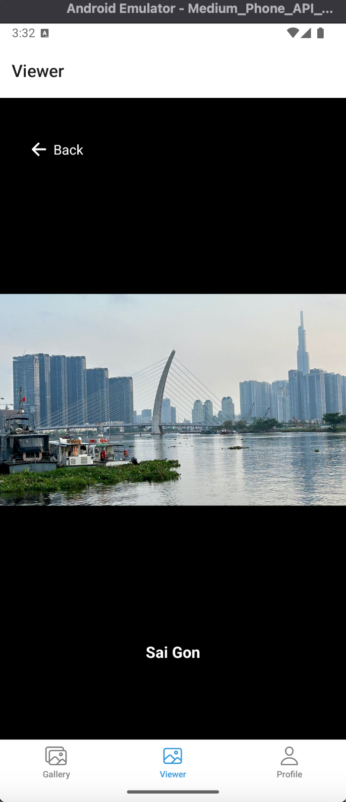
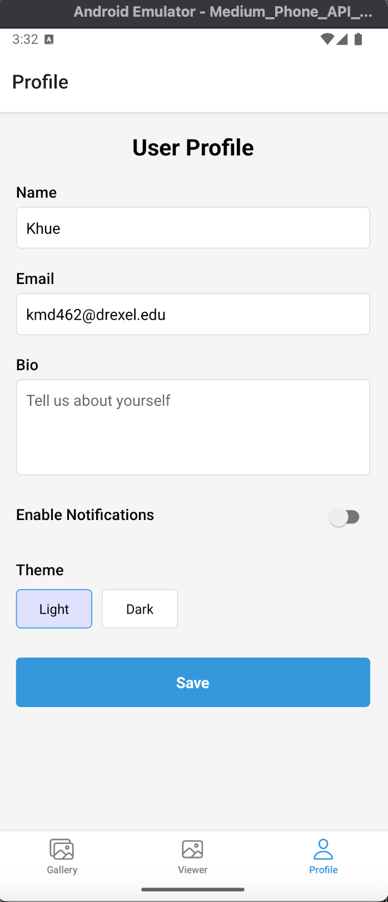

# KD_INFO670

Khue Dao

My First React Native App

## Screenshots Assignment 1

## Assignment 2: Grocery List App
A simple grocery shopping list application built with React Native.

### Design and Purpose
The Grocery List App is designed to help users manage their grocery shopping efficiently. With a user-friendly interface, it allows users to create, edit, and track grocery items during their shopping trips. This app is for anyone who wants an organized approach to grocery shopping without complex features or a steep learning curve.

### Basic Use

Adding Items:

- Type the grocery item name in the main input field
- Enter the quantity (optional - defaults to 1)
- Tap the "Add" button to add the item to your list

Marking Items as Purchased:

- Tap on an item to mark it as purchased (it will be crossed out)
- Tap again to mark it as not purchased

Editing Items:

- Tap the "Edit" button next to any item
- The item details will appear in the input fields at the top
- Make your changes and tap the "Update" button

Deleting Items:

- Tap the "Delete" button next to any item to remove it from the list

## Screenshots

Main Screen

The main screen displays the grocery list and provides controls for managing items.

Adding Items

Users can easily add new grocery items with quantities using the input fields at the top.

Purchased Items

Items can be marked as purchased by tapping on them, which shows a visual indicator (strikethrough).

Update and Edit Items

Item's name and quantity can be edited by tapping the edit button, making changes, and tapping update to save the changes. Tapping delete will remove the item completely from the list.

### Features

- Add, edit, and delete grocery items
- Add quantities for each item
- Mark items as purchased/not purchased
- Error handling for empty item input
- Responsive layout that works on various screen sizes
- Visual indicators for purchased items
- Counter showing the total number of items

### Technical Implementation
This app was built using React Native and demonstrates the following concepts:

- State Management: Using React hooks (useState) to manage application state
- Component Structure: Proper use of React Native core components
- Layout Techniques: Flexbox for responsive and intuitive layouts
- Styling: Custom StyleSheet implementation for consistent design
- Error Handling: Input validation and user feedback

### React Native Components Used

- View: For layout containers
- Text: For displaying item names, quantities, and labels
- TextInput: For user input when adding/editing items
- Button: For triggering actions (add, update)
- FlatList: For efficiently rendering the scrollable grocery list
- TouchableOpacity: For handling touch events on items and buttons
- Alert: For error messages
- SafeAreaView: For handling safe areas on different devices
- StatusBar: For customizing the device status bar

## Assignment 3: Mobile Gallery App

### Design and Purpose
This mobile application is designed as a gallery viewer that allows users to browse through a collection of beautiful Vietnam images. The app features a simple and intuitive interface with three main screens: Gallery, Viewer, and Profile. It serves as both a practical photo viewer and a user customization example. The target audience can be photographers, travelers, explorers, or researchers who want to know more about the country.

### Features

Gallery Screen

- Displays a visually appealing grid of image thumbnails with descriptive captions
- Features a responsive layout that adapts to different screen sizes
- Shows high-quality images of Vietnam's mountains, beaches, forests, and cities
- Implements smooth scrolling and touch interactions

Picture Viewer Screen

- Provides a full-screen viewing experience for selected images
- Features a distraction-free dark background to emphasize the image
- Includes a convenient back button for easy navigation
- Displays the image title for context

Profile Screen

- Allows users to personalize their experience
- Includes multiple input types (text fields, switches, custom radio buttons)
- Saves user preferences to local storage for persistence between sessions
- Implements form validation to prevent invalid data submission

### Screenshots

Gallery Screen

The Gallery screen displays a grid of Vietnam-themed images with titles

Viewer Screen

The Picture Viewer screen shows the selected image in full-screen mode

Profile

The Profile screen allows users to customize their experience

### Technical Implementation

Architecture

- Built with React Native and Expo for cross-platform compatibility
- Implements bottom tab navigation using React Navigation
- Uses component-based architecture for modularity and reusability
- Employs responsive design principles for various device sizes

Key Technologies

- React Native for the user interface
- React Navigation for screen navigation
- AsyncStorage for local data persistence
- Custom styling with StyleSheet
- Expo vector icons for navigation tab icons

Data Management

- Local storage implementation for user profile data
- Error handling and validation for form inputs
- Efficient image rendering with proper sizing and caching

## Assignment 4: Messaging App

### App Overview

This is a mobile messaging application that allows users to send and receive messages through a React Native frontend connected to PHP backend APIs. The app demonstrates full-stack development with API integration and optional database functionality.
- Purpose: Enable users to send messages to each other and retrieve their received messages through a simple, intuitive mobile interface.
- Target Audience: General users who need a basic messaging platform for communication.

### Screenshots

- Shows input fields for sender username, recipient username, and message
- Button to send the message
- Navigation button to go to inbox

- Shows input field for username
- Retrieve button to fetch messages
- List of received messages with sender and timestamp
- Pull-to-refresh functionality
