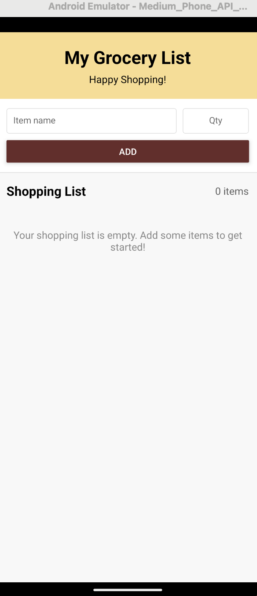
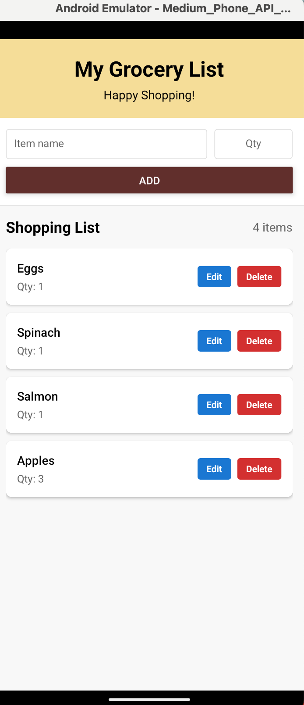
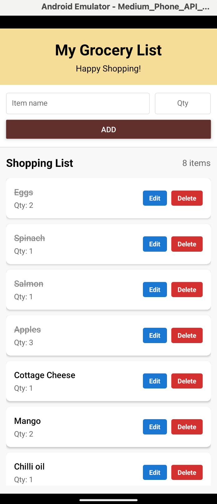
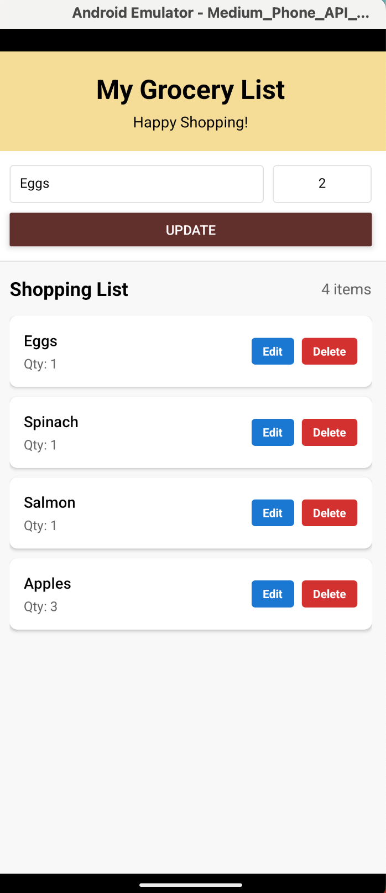
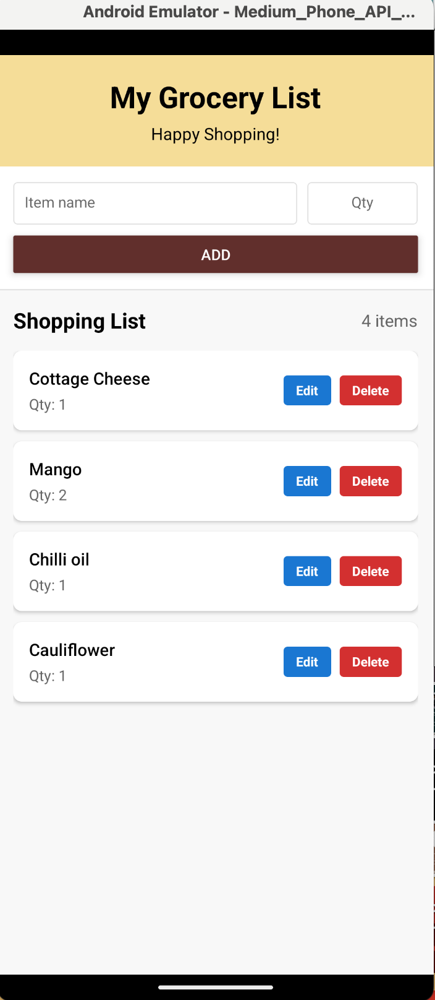

# KD_INFO670

Khue Dao

My First React Native App

## Screenshots

## Grocery List App
A simple grocery shopping list application built with React Native.

### Design and Purpose
The Grocery List App is designed to help users manage their shopping efficiently. With a clean and user-friendly interface, it allows users to create, edit, and track grocery items during their shopping trips. This app is targeted towards anyone who wants an organized approach to grocery shopping without complex features or a steep learning curve.

### Basic Use

Adding Items:

Type the grocery item name in the main input field
Enter the quantity (optional - defaults to 1)
Tap the "Add" button to add the item to your list

Marking Items as Purchased:

Tap on an item to mark it as purchased (it will be crossed out)
Tap again to mark it as not purchased

Editing Items:

Tap the "Edit" button next to any item
The item details will appear in the input fields at the top
Make your changes and tap the "Update" button

Deleting Items:

Tap the "Delete" button next to any item to remove it from the list

## Screenshots

Main Screen

The main screen displays the grocery list and provides controls for managing items.

Adding an Item

Users can easily add new grocery items with quantities using the input fields at the top.

Purchased Items

Items can be marked as purchased by tapping on them, which shows a visual indicator (strikethrough).

Update and Edit Items

Item's name and quatity can be edited by tapping the edit button and tapping update to save the changes. Tapping delete will remove the item completely from the list.

### Features

Add, edit, and delete grocery items
Add quantities for each item
Mark items as purchased/not purchased
Error handling for empty item input
Responsive layout that works on various screen sizes
Visual indicators for purchased items
Counter showing the total number of items

### Technical Implementation
This app was built using React Native and demonstrates the following concepts:

State Management: Using React hooks (useState) to manage application state
Component Structure: Proper use of React Native core components
Layout Techniques: Flexbox for responsive and intuitive layouts
Styling: Custom StyleSheet implementation for consistent design
Error Handling: Input validation and user feedback

### React Native Components Used

View: For layout containers
Text: For displaying item names, quantities, and labels
TextInput: For user input when adding/editing items
Button: For triggering actions (add, update)
FlatList: For efficiently rendering the scrollable grocery list
TouchableOpacity: For handling touch events on items and buttons
Alert: For error messages
SafeAreaView: For handling safe areas on different devices
StatusBar: For customizing the device status bar